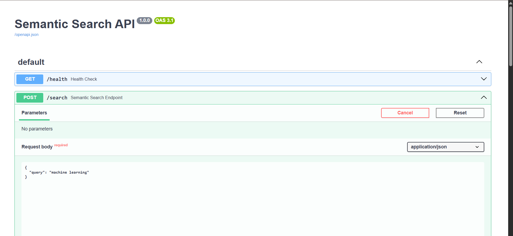
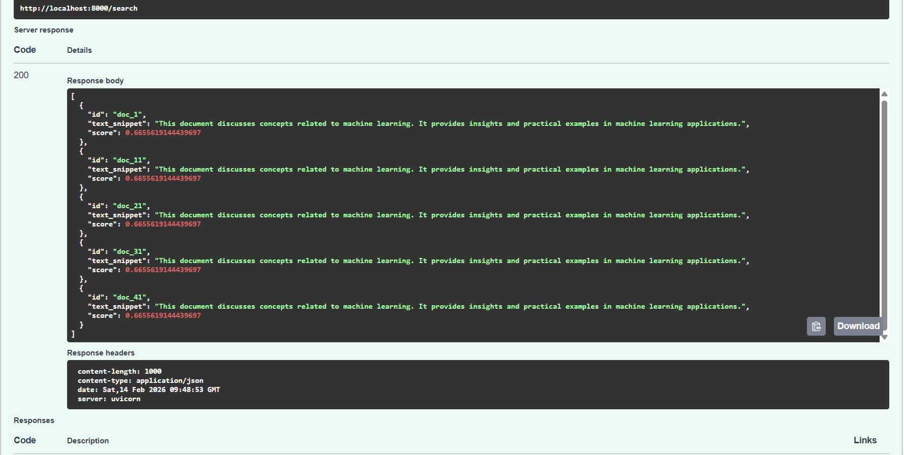

# Scalable Semantic Search API with FastAPI & FAISS

A production-ready, containerized semantic search backend built using **FastAPI**, **SentenceTransformers**, and **FAISS**.

This project implements a high-performance vector-based search system capable of retrieving semantically relevant documents beyond traditional keyword matching.

---

## API Demo

### Swagger UI

<p align="center">
  
</p>

### Semantic Search Response

<p align="center">
  
</p>

---

## Overview

Traditional keyword search systems fail to capture contextual meaning.  
This project implements **semantic similarity search** using dense vector embeddings and FAISS indexing.

The system:

- Converts documents into embeddings using Sentence-BERT
- Stores embeddings in a FAISS vector index
- Accepts user queries
- Returns the top-K most semantically relevant results

Designed with:

- Clean architecture
- Singleton model loading
- Environment-driven configuration
- Centralized error handling
- Unit and integration testing
- Docker-based reproducibility

---

## Architecture Overview

```
Client → FastAPI → SearchService → 
  ↳ SentenceTransformer (Embedding Model)
  ↳ FAISS Index (Vector DB)
  ↳ Document Store (JSON)
```

### Design Principles

- **Separation of Concerns**
- **Singleton Pattern for Model Loading**
- **Environment Variable Configuration**
- **Fail-Fast Initialization**
- **Centralized Exception Handling**
- **Docker Reproducibility**

---

## Tech Stack

- Python 3.10
- FastAPI
- SentenceTransformers
- FAISS (IndexFlatL2)
- Pytest
- Docker & Docker Compose

---

## Project Structure

```
semantic-search-api/
├── app/
│   ├── main.py
│   └── services/search_service.py
├── data/
│   ├── documents.json
│   ├── faiss_index.bin
│   └── embeddings.npy
├── models/
│   └── sentence_transformer/
├── scripts/
│   └── generate_embeddings.py
├── tests/
│   ├── unit/
│   └── integration/
├── Dockerfile
├── docker-compose.yml
├── .env.example
├── requirements.txt
└── README.md
```

---

# Setup Instructions

---

## 🔹 1️.Local Setup

### Step 1: Clone Repository

```bash
git clone "https://github.com/rakeshchinni77/semantic-search-api"
cd semantic-search-api
```

### Step 2: Create Virtual Environment

```bash
python -m venv venv
venv\Scripts\activate
```

### Step 3: Install Dependencies

```bash
pip install --upgrade pip
pip install -r requirements.txt
```

### Step 4: Generate Embeddings & FAISS Index

```bash
python scripts/generate_embeddings.py
```

This will:
- Generate synthetic dataset (1000+ documents)
- Create embeddings
- Create FAISS index

---

### Step 5: Configure Environment

Create `.env` from `.env.example`:

```
API_TITLE=Semantic Search API
API_VERSION=1.0.0
API_PORT=8000

TOP_K_RESULTS=5

MODEL_NAME=sentence-transformers/all-MiniLM-L6-v2
MODEL_CACHE_DIR=models/sentence_transformer

DATA_DIR=data
DOCUMENTS_FILE=documents.json
FAISS_INDEX_FILE=faiss_index.bin
```

---

### Step 6: Run API

```bash
uvicorn app.main:app --reload
```

Open:

```
http://127.0.0.1:8000/docs
```

---

## 2️.Docker Setup (Recommended)

### Build & Run

```bash
docker-compose up --build
```

Access:

```
http://localhost:8000/docs
```

Health Check:

```
http://localhost:8000/health
```

The container includes:

- Healthcheck
- Restart policy
- Volume mounting for data persistence

---

# Running Tests

```bash
pytest -v
```

Test Coverage Includes:

- Service initialization
- FAISS loading
- Query validation
- Result formatting
- API endpoint testing
- Error handling

---

# API Documentation

---

## 🔹 GET /health

Returns service health status.

### Response

```json
{
  "status": "ok"
}
```

Status Code: `200 OK`

---

## POST /search

Performs semantic search.

### Request Body

```json
{
  "query": "machine learning"
}
```

### Response

```json
[
  {
    "id": "doc_1",
    "text_snippet": "This document discusses concepts related to machine learning...",
    "score": 0.6655
  }
]
```

### Status Codes

- `200 OK` → Successful search
- `400 Bad Request` → Invalid query
- `422 Unprocessable Entity` → Missing required field
- `500 Internal Server Error` → System error

---

# Technical Decisions

---

## Why SentenceTransformers?

- Efficient sentence-level embeddings
- Balanced performance and speed
- Pretrained models available
- Strong semantic representation

Model used:

```
sentence-transformers/all-MiniLM-L6-v2
```

---

## Why FAISS?

- High-performance vector similarity search
- In-memory fast retrieval
- Optimized C++ backend
- Production-proven in large-scale systems

Index Type:

```
IndexFlatL2
```

Chosen for simplicity and deterministic behavior.

---

## Why FastAPI?

- Automatic OpenAPI documentation
- High performance (ASGI)
- Pydantic validation
- Clean dependency injection

---

# Performance Considerations

- Model and FAISS index loaded once (Singleton)
- No reload per request
- Vector search complexity: O(n)
- Suitable for moderate dataset sizes
- Easily extendable to IVF / HNSW for large-scale systems

---

# Scalability Considerations

For production-scale deployment:

- Replace IndexFlatL2 with IVF or HNSW
- Use GPU FAISS for acceleration
- Move FAISS to external vector DB (Pinecone, Milvus)
- Add caching layer (Redis)
- Horizontal scaling with load balancer
- Async batching for embeddings
- Model quantization

---

# Error Handling

- Custom exceptions
- Centralized FastAPI exception handlers
- No stack trace exposure
- Proper HTTP status mapping

---

# Reproducibility

The system is fully reproducible via:

```bash
docker-compose up --build
```

No manual configuration required.

---

# Test Coverage

Includes:

- Unit tests for SearchService
- Integration tests for API endpoints
- Validation testing
- Error simulation testing

---

# Common Mistakes Avoided

- No hardcoded configuration
- No model reload per request
- No business logic in main.py
- No stack trace exposure
- Proper validation implemented
- Proper Docker healthcheck configured

---

# Future Improvements

- Add async embedding batching
- Add pagination
- Add authentication layer
- Replace JSON store with database
- Add metrics and monitoring
- Add CI/CD pipeline

---

# Conclusion

This project demonstrates:

- Production-ready backend architecture
- AI model serving best practices
- Vector database integration
- Clean code principles
- Dockerized deployment
- Automated testing strategy

Built with a focus on scalability, maintainability, and reliability.

---

```
Developed as part of an AI Engineering training program focused on real-world system design and deployment.
```
